# D2l

Personal project going through the "Dive into Deep Learning" book and coding things I find interesting.

## Description

Implementing chapters I find interesting from the book.
For learning purposes, almost all the code is written manually, without LSP.
To test the implementations, I add training experiments that can be ran with wandb.

Currently done:
- Chapter 07
- Chapter 08

## Chapter 07 : Convolutional Neural Networks

Chapter 07 covers the intuition and maths behind Convolutional Layers and Convolutional Neural networks.

### Modules implementation

7.01 through 7.05 covers all the necessary modules to build the basic LeNet.
They are implemented from scratch in this [modules.py file](ch_07_Convolutional_Neural_Network/modules.py):

#### Convolutional layers

Implemented two versions:
- Conv2dNotOpti: Slow version that uses 7 nested loops to compute the output.
- Conv2d: Faster version that uses im2col to reduce the complexity.

Tested them by comparing the outputs of their forward pass to [nn.Conv2d](https://docs.pytorch.org/docs/2.11/generated/torch.nn.Conv2d.html) in [test_ch07.py::TestModules](tests/test_ch07.py).

This does not support all parameters used by the torch implemention (no groups, dilation...)

#### Pool layers

Implemented MaxPool2d.
Deviates from the book which used AvgPool2d to respect the LeNet design.

Tested them by comparing the outputs of its forward pass to [nn.MaxPool2d](https://docs.pytorch.org/docs/2.11/generated/torch.nn.MaxPool2d.html) in [test_ch07.py::TestModules](tests/test_ch07.py).

This does not support all parameters used by the torch implemention (dilation, return_indices...)

#### Linear layers

Implemented Linear.
This is not from this chapter, but ended up doing it so that I can test with all manual layers.

Tested them by comparing the outputs of its forward pass to [nn.Linear](https://docs.pytorch.org/docs/2.11/generated/torch.nn.modules.linear.Linear.html) in [test_ch07.py::TestModules](tests/test_ch07.py).

### CNN implementation

7.06 covers the design of the original LeNet model.
My implementation uses MaxPool instead of AvgPool.
I avoid Lazy layers so that I have to compute the shapes at every step. 
It is implemented in this [cnn.py file](ch_07_Convolutional_Neural_Network/cnn.py):

#### Model implementation

Implemented CNN that supports 3 implementation modes:
- Implementation.TORCH: uses torch layers for convolution, max pooling and linear.
- Implementation.MANUAL_OPTI: uses implemented max pooling and linear, along with optimized implemented version for convolution.
- Implementation.MANUAL_BASE: uses implemented max pooling and linear, along with non-optimized implemented version for convolution
As mentioned before, I used MaxPool instead of the original AvgPool

#### Training

Training uses a config that supports the following:
- implem: Implementation.TORCH, Implementation.MANUAL_OPTI, Implementation.MANUAL_BASE
- device: "cuda" or "cpu"
- num_epochs: int
- batch_size: int
- optim: Optim.SGD or Optim.ADAM
- lr: float
- project_name: name of your wandb project or None if you don't want wandb
- run_name: name of your wandb run name or None if you want it to be automatically generated
- job_type: name of your wandb job type or None
- dataset: DatasetVersion.MNIST or DatasetVersion.FASHION_MNIST, based on which dataset you want to train on

To ensure results are the same everytime, a seed is set at the beginning

#### Wandb experiments

Add option for training in wandb. It logs the following:
- epoch
- train step metrics (loss and accuracy)
- train epochs metrics (loss and accuracy)
- validation epochs metrics (loss and accuracy)
- Images for the activations of the model for convolutions and linear layers. It does it for one real input and one noise input.

#### Results

Results deviate from the ones visible in d2l.ai.
The main reasons is the use of ReLU + MaxPool instead of Sigmoid + AvgPool.
You can find below the graph of training and val loss and accuracy for FASHION MNIST (Used in the book) and MNIST.
As well as the activations throughout the final model, for an actual input and a noisy input (Those were questions at the end of the chapter).

##### Fashion-MNIST

  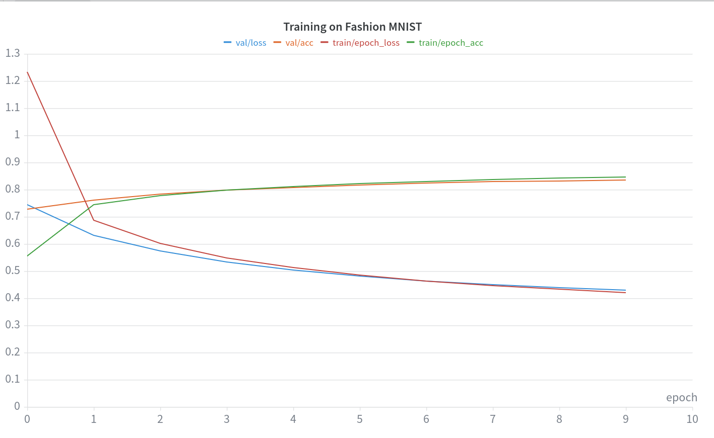

  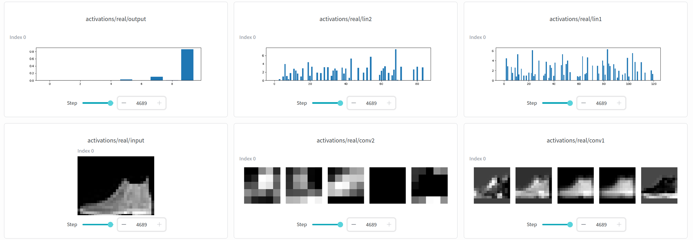
  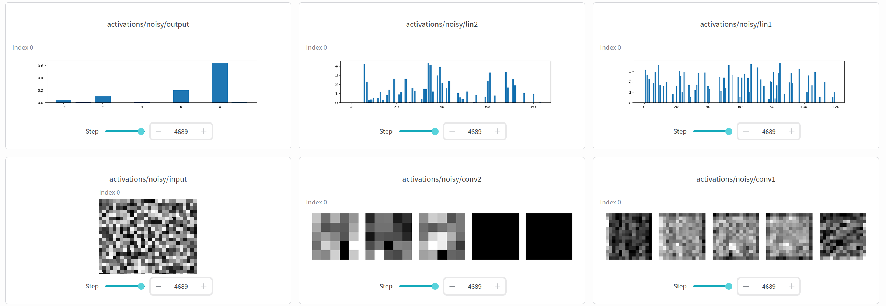 
  <em>Left: Real input — Right: Noisy input</em>

---

##### MNIST

  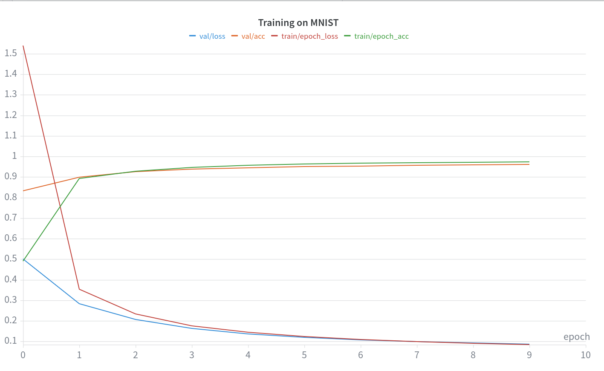

  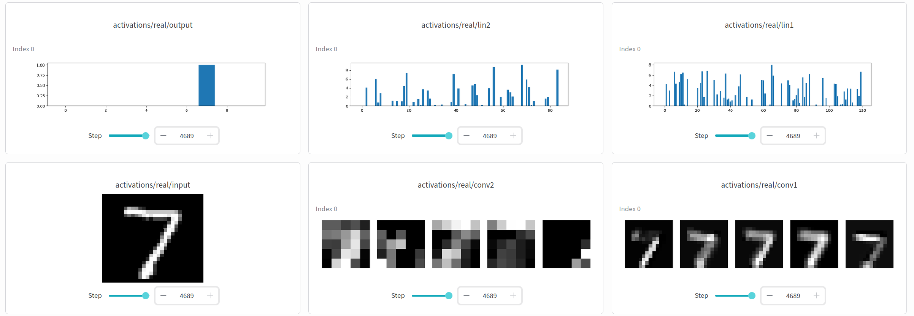
  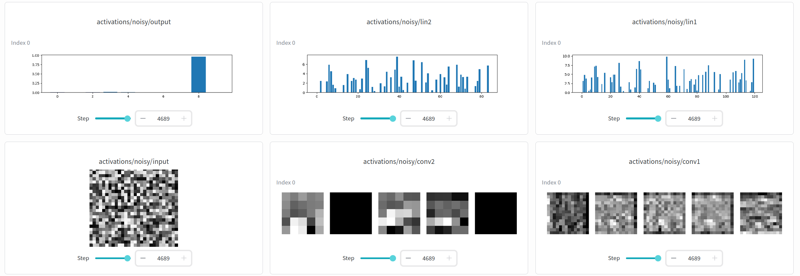 
  <em>Left: Real input — Right: Noisy input</em>

## Chapter 08 : Modern Convolutional Neural Networks

Chapter 08 covers the evolution of CNNs across the 2010s.
For each of them, I implemented them, and ran training on some datasets.

### Setup

Since all models of this chapter do the same task. I built a general setup so that new models could just be plugged in. Here are the main parts:

#### Training

Training uses a config that supports the following:
- project_name: name of your wandb project or None if you don't want wandb
- run_name: name of your wandb run name or None if you want it to be automatically generated
- group_name: name of your wandb group name or None
- dataset_name: path of the dataset you want to run the training on
- optim: Optim.SGD or Optim.ADAM
- lr: float
- device: "cuda" or "cpu"
- batch_size: int
- num_epochs: int
- use_augmentation: bool
- initialization: Initialization.Xavier or Initialization.Kaiming
- num_classes: number of classes in the dataset

Additional details:
- Models are saved in a model registry (dict[str, type[nn.Module]]) so that adding new models is easy.
- Two initializers are tested: Xavier (which is used by d2l) and Kaiming (added by me).
- Datasets are created from torchvision [ImageFolder](https://docs.pytorch.org/vision/main/generated/torchvision.datasets.ImageFolder.html) and should accept any path that respects the required structure. So any classification task.
- Augmentation of training data is optional. When enabled, it can perform random horizontal flip, color jitter, gaussian blur, random erasing, random rotation.

#### Wandb experiments

Add option for training in wandb. It logs the following:
- epoch
- train step metrics (loss and accuracy)
- train epochs metrics (loss and accuracy)
- validation epochs metrics (loss and accuracy)

#### Testing

Model tests are done in [tests/test_ch08.py::TestModels](tests/test_ch08.py).
Here are the main ones:
- Test forward and backward pass: check that the forward pass runs, backward pass runs, gradients are computed, no Nan/Inf, no unused parameters.
- Test param count: for models where the information is available, test that the parameter count matches the one reported
- Test flops count: for models where the information is available, test that the flops matches the one reported. 

Parameters and FLOPs are computed with my own functions in [utils.py](ch_08_Modern_Convolutional_Neural_Networks/utils.py). I compute FLOPs instead of MACs like most papers so the count provided by my function needs to be divided by 2.

### Models

Models implementation are presented briefly below.
6 training runs were done for each models with the following setups:
- Dataset [Imagenette](https://github.com/fastai/imagenette#imagenette-1), no augmentation of training data, xavier initialization
- Dataset Imagenette, augmentation of training data, xavier initialization
- Dataset Imagenette, augmentation of training data, kaiming initialization
- Dataset [Imagewoof](https://github.com/fastai/imagenette#imagewoof), no augmentation of training data, xavier initialization
- Dataset Imagewoof, augmentation of training data, xavier initialization
- Dataset Imagewoof, augmentation of training data, kaiming initialization

Training was done either on 3060 or 4070 super NVIDIA GPUs.

Config was the following:
- Batch size: 32 or 64 (did not realize that the batch size was set differently on both GPUs, might be reran later on for consistency)
- Optimizer: ADAM
- Learning rate: 1e-4 (no scheduler)
- Num epochs: 30 (no early stopping)
- Num classes: 10 (Imagenette and Imagewoof are smaller than Imagenet and were used for iteration speed)

The validation accuracy curves are detailed for each models/dataset pair.
Imagenette is easier to classify than Imagewoof, which is noticeable in the results.

#### AlexNet (Chapter 8.01)

AlexNet is the first model introduced.
Compared to LeNet, it is deeper and introduced ReLU activations and Dropout.

It is implemented [here](ch_08_Modern_Convolutional_Neural_Networks/alex_net.py).
For this, I based myself on the d2l implementation.

The torchvision implementation does not match it (padding on the first conv layer is 2, which leads to more input_fatures on the first linear layer) so AlexNet is not included in the parameter and flops tests. Changing the padding of conv1 to 2 and the in_features of lin1 to 9216 is sufficient to match both torchvision counts.

##### Model info

| Metric | Value | Rank (out of 10) |
|---|---|---|
| Parameters | 50,844,008 | 2 |
| FLOPs | 2,020,501,096 | 8 |

Because it is one of the only model with several final linear layers, the parameter count is quite high.
Because there are less convolutions, the FLOPs count is lower.

##### Results

  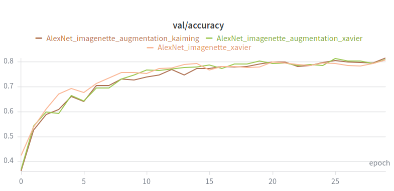
  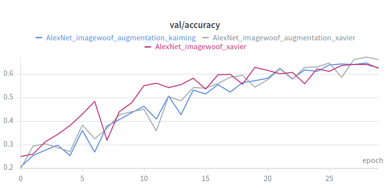 
  <em>Left: Validation accuracy on imagenette — Right: Validation accuracy on imagewoof</em>

Below is a table with the maximum validation accuracy for each run and the rank among all 30 training runs on the same dataset (3 runs per model and 10 models)

<table>
<tr><td>

**Imagenette**

| Run type | Max val acc | Rank (out of 30) |
|---|---|---|
| no_aug_xavier | 0.8074 | 20 |
| aug_xavier | 0.8134 | 18 |
| aug_kaiming | 0.8160 | 16 |

</td><td>

**Imagewoof**

| Run type | Max val acc | Rank (out of 30) |
|---|---|---|
| no_aug_xavier | 0.6415 | 18 |
| aug_xavier | 0.6730 | 15 |
| aug_kaiming | 0.6472 | 16 |

</td></tr>
</table>

Results are decent on both datasets but quite far from the best models.

#### VGG (Chapter 8.02)

VGG introduced using blocks and a more modular architecture compared to AlexNet
It also uses 3 by 3 kernels and deeper networks. 
It is implemented [here](ch_08_Modern_Convolutional_Neural_Networks/vgg.py).
For this, I based myself on the d2l implementation.

There are 4 implementations available in the library:
- VGGSmaller: Not an official version, it is just a smaller version I made for testing
- VGG11, VGG16, VGG19: From the original paper. The parameter count from all of those match the implementations in torchvision.

I only did the training on VGGSmaller and VGG16 (others might follow later).

##### VGGSmaller

###### Model info

| Metric | Value | Rank (out of 10) |
|---|---|---|
| Parameters | 47,149,640 | 3 |
| FLOPs | 1,063,188,456 | 10 |

Because of the linear layers, there is still a high parameter count. Even as a smaller version of the model.
But the number of FLOPs is the lowest out of all the models tested.

###### Results

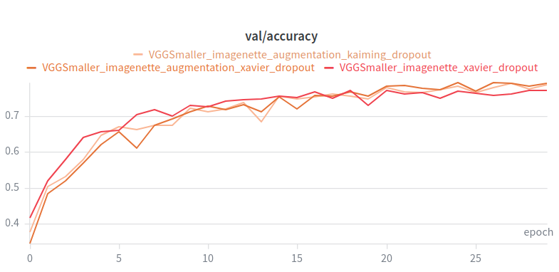
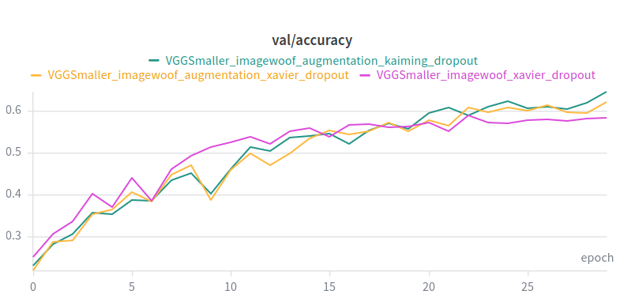 
<em>Left: Validation accuracy on imagenette — Right: Validation accuracy on imagewoof</em>

Below is a table with the maximum validation accuracy for each run and the rank among all 30 training runs on the same dataset (3 runs per model and 10 models)

<table>
<tr><td>

**Imagenette**
| Run type | Max val acc | Rank (out of 30) |
|---|---|---|
| no_aug_xavier | 0.7710 | 27 |
| aug_xavier | 0.7930 | 24 |
| aug_kaiming | 0.7903 | 26 |

</td><td>

**Imagewoof**
| Run type | Max val acc | Rank (out of 30) |
|---|---|---|
| no_aug_xavier | 0.5892 | 24 |
| aug_xavier | 0.6208 | 21 |
| aug_kaiming | 0.6458 | 17 |

</td></tr>
</table>

Results are weak on both datasets, which is expected given that this is a dumbed down version of VGG11.

##### VGG16

###### Model info

| Metric | Value | Rank (out of 10) |
|---|---|---|
| Parameters | 138,357,544 | 1 |
| FLOPs | 30,954,085,352 | 1 |

This is the model with the most parameters and the most FLOPs.

###### Results

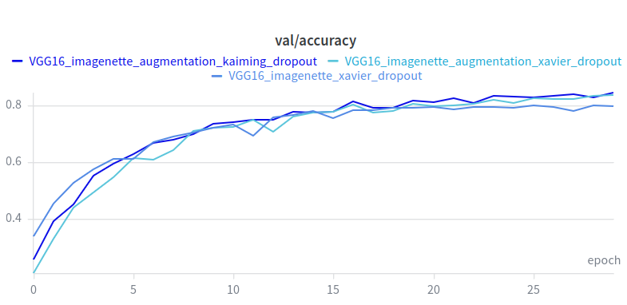
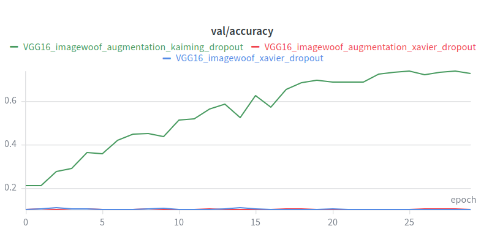 
<em>Left: Validation accuracy on imagenette — Right: Validation accuracy on imagewoof</em>

Below is a table with the maximum validation accuracy for each run and the rank among all 30 training runs on the same dataset (3 runs per model and 10 models)

<table>
<tr><td>

**Imagenette**
| Run type | Max val acc | Rank (out of 30) |
|---|---|---|
| no_aug_xavier | 0.8000 | 22 |
| aug_xavier | 0.8344 | 14 |
| aug_kaiming | 0.8456 | 9 |

</td><td>

**Imagewoof**
| Run type | Max val acc | Rank (out of 30) |
|---|---|---|
| no_aug_xavier | 0.1090 | 29 |
| aug_xavier | 0.1059 | 30 |
| aug_kaiming | 0.7375 | 9 |

</td></tr>
</table>

Imagenette results are good and improve nicely with augmentation and kaiming. 
On imagewoof, both xavier runs are stuck around 10%, which is random performance for a 10 class task. Only the kaiming run trained correctly. 

#### NiN (Chapter 8.03)

NiN is the first model introduced to get rid of the final linear layers.
Instead it uses at the end global average pooling on the output of the final convolutional layer.
Because it came out right after AlexNet, it uses the same kernel sizes (instead of the 3*3 like following models)
It is implemented [here](ch_08_Modern_Convolutional_Neural_Networks/nin.py).
For this, I based myself on the d2l implementation.

##### Model info

| Metric | Value | Rank (out of 10) |
|---|---|---|
| Parameters | 7,439,608 | 9 |
| FLOPs | 1,932,745,592 | 9 |

It is among the smallest models in terms of both parameters and flops. Removing the final linear layers (which were the main part of AlexNet's parameters) is what makes the parameter count so low.

##### Results

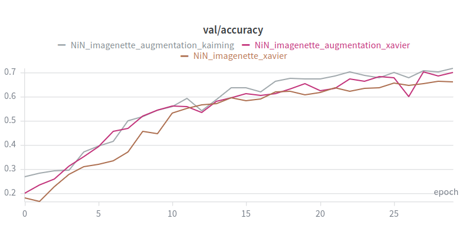
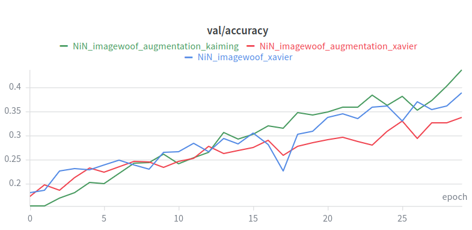 
<em>Left: Validation accuracy on imagenette — Right: Validation accuracy on imagewoof</em>

Below is a table with the maximum validation accuracy for each run and the rank among all 30 training runs on the same dataset (3 runs per model and 10 models)

<table>
<tr><td>

**Imagenette**
| Run type | Max val acc | Rank (out of 30) |
|---|---|---|
| no_aug_xavier | 0.6647 | 30 |
| aug_xavier | 0.7028 | 29 |
| aug_kaiming | 0.7194 | 28 |

</td><td>

**Imagewoof**
| Run type | Max val acc | Rank (out of 30) |
|---|---|---|
| no_aug_xavier | 0.3897 | 27 |
| aug_xavier | 0.3385 | 28 |
| aug_kaiming | 0.4375 | 26 |

</td></tr>
</table>

NiN gets the worst results out of all the models tested. Looking at the curves, it seems like it could do better with more training.

#### GoogLeNet (Chapter 8.04)

GoogLeNet introduced the idea of passing an input through several different convolution operations and aggregate the outputs along the channel dimension.
This operation is done inside an Inception block.
It is implemented [here](ch_08_Modern_Convolutional_Neural_Networks/googlenet.py).
For this, I based myself on the d2l implementation.

##### Model info

| Metric | Value | Rank (out of 10) |
|---|---|---|
| Parameters | 6,998,552 | 10 |
| FLOPs | 3,168,570,904 | 7 |

It has the lowest parameter count, and also reasonably small FLOPs count.

##### Results

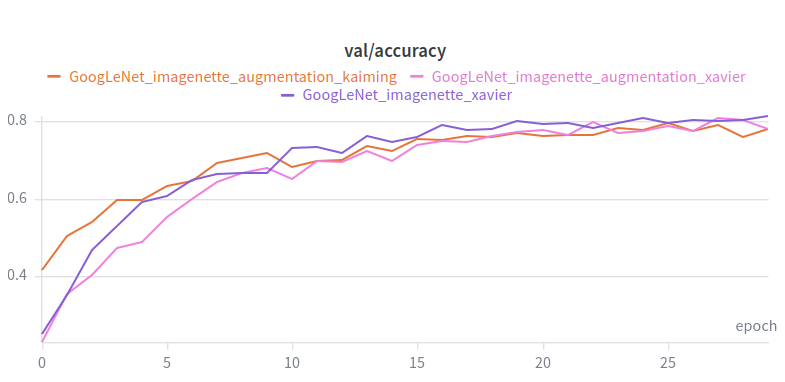
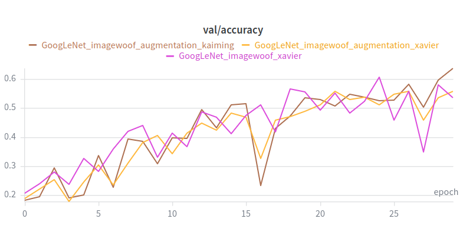 
<em>Left: Validation accuracy on imagenette — Right: Validation accuracy on imagewoof</em>

Below is a table with the maximum validation accuracy for each run and the rank among all 30 training runs on the same dataset (3 runs per model and 10 models)

<table>
<tr><td>

**Imagenette**
| Run type | Max val acc | Rank (out of 30) |
|---|---|---|
| no_aug_xavier | 0.8144 | 17 |
| aug_xavier | 0.8074 | 21 |
| aug_kaiming | 0.7940 | 23 |

</td><td>

**Imagewoof**
| Run type | Max val acc | Rank (out of 30) |
|---|---|---|
| no_aug_xavier | 0.6066 | 23 |
| aug_xavier | 0.5585 | 25 |
| aug_kaiming | 0.6377 | 19 |

</td></tr>
</table>

Interestingly, the no augmentation run on imagenette gets the best result.
On imagewoof, the augmented xavier run is the worst. This is the only model where augmentation does not consistently help.
The imagewoof curves are very noisy with large oscillations.

#### ResNet18 (Chapter 8.06)

ResNet introduced the famous residual connections, which consists in adding the input back into the output of an operation. This allows for a layer to learn the identity function more easily and not lose the information the deeper the network is.
It is also the first model in our implementations to use batch normalization after the convolution layers.
It is implemented [here](ch_08_Modern_Convolutional_Neural_Networks/resnet.py).
For this, I based myself on the d2l implementation. It matches also the torchvision parameter count and flops count.

##### Model info

| Metric | Value | Rank (out of 10) |
|---|---|---|
| Parameters | 11,689,512 | 7 |
| FLOPs | 3,628,147,688 | 6 |

A relatively small model in both parameters and FLOPs, sitting in the middle of the pack.

##### Results

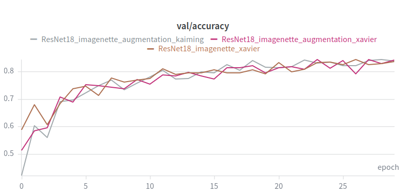
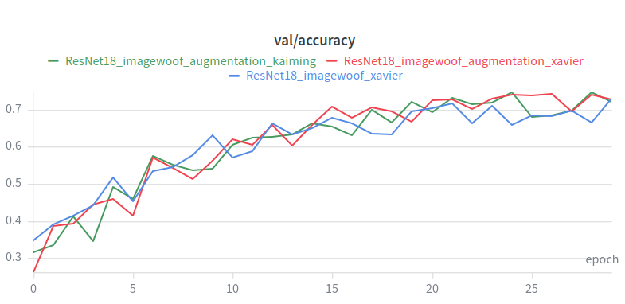 
<em>Left: Validation accuracy on imagenette — Right: Validation accuracy on imagewoof</em>

Below is a table with the maximum validation accuracy for each run and the rank among all 30 training runs on the same dataset (3 runs per model and 10 models)

<table>
<tr><td>

**Imagenette**
| Run type | Max val acc | Rank (out of 30) |
|---|---|---|
| no_aug_xavier | 0.8422 | 13 |
| aug_xavier | 0.8436 | 11 |
| aug_kaiming | 0.8432 | 12 |

</td><td>

**Imagewoof**
| Run type | Max val acc | Rank (out of 30) |
|---|---|---|
| no_aug_xavier | 0.7287 | 10 |
| aug_xavier | 0.7414 | 7 |
| aug_kaiming | 0.7475 | 6 |

</td></tr>

</table>

Solid results. The three runs are very close on imagenette and augmentation gives a clearer benefit on imagewoof.

#### ResNext50 (Chapter 8.06)

ResNext introduced to ResNet grouped convolutions so that learning can be done in parallel and cheaper.
It is implemented [here](ch_08_Modern_Convolutional_Neural_Networks/resnext.py).
For this, I based myself on the d2l implementation. It matches also the torchvision parameter count and flops count.

For practice, I implemented the blocks in two different ways: one that does the grouped convolutions manually and one that uses the groups parameter of nn.Conv2d

##### Model info

| Metric | Value | Rank (out of 10) |
|---|---|---|
| Parameters | 25,028,904 | 4 |
| FLOPs | 8,460,960,744 | 3 |

This version is much larger than the resnet version mentioned previously.

##### Results

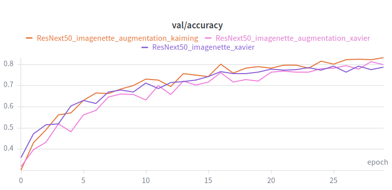
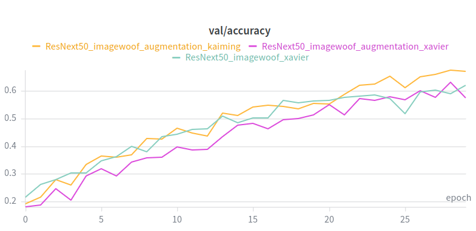 
<em>Left: Validation accuracy on imagenette — Right: Validation accuracy on imagewoof</em>

Below is a table with the maximum validation accuracy for each run and the rank among all 30 training runs on the same dataset (3 runs per model and 10 models)

<table>
<tr><td>

**Imagenette**
| Run type | Max val acc | Rank (out of 30) |
|---|---|---|
| no_aug_xavier | 0.7905 | 25 |
| aug_xavier | 0.8123 | 19 |
| aug_kaiming | 0.8311 | 15 |

</td><td>

**Imagewoof**
| Run type | Max val acc | Rank (out of 30) |
|---|---|---|
| no_aug_xavier | 0.6194 | 22 |
| aug_xavier | 0.6298 | 20 |
| aug_kaiming | 0.6750 | 14 |

</td></tr>

</table>

ResNext50 does worse than ResNet18 here, despite being a bigger and more recent architecture. It probably comes down to the training regimen.
But augmentation and kaiming initialization both help.

#### DenseNet

DenseNet introduced connecting each layer to all previous layers in the block instead of just the previous one. It does so by concatenating their feature maps instead of simply using skip connections from the previous layer like ResNet.
It is implemented [here](ch_08_Modern_Convolutional_Neural_Networks/densenet.py).
For this, I based myself on the d2l implementation.

There are 3 implementations available in the library: DenseNet121, DenseNet169, DensetNet201. From the original paper.

The parameter count from all of those match the implementations in torchvision.

##### DenseNet121

###### Model info

| Metric | Value | Rank (out of 10) |
|---|---|---|
| Parameters | 7,978,856 | 8 |
| FLOPs | 5,668,324,328 | 5 |

A small parameter count thanks to the feature reuse from the dense connections, but a moderate amount of FLOPs because the concatenations make the inputs to later layers wider.

###### Results

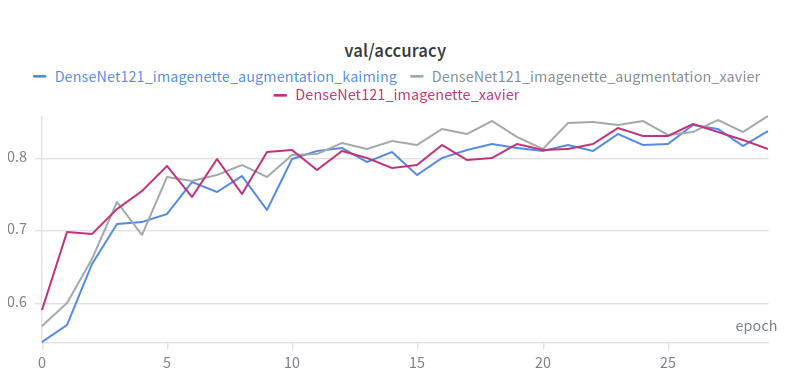
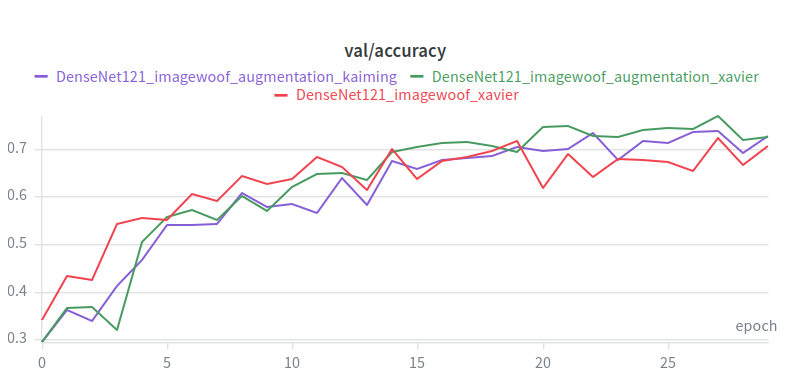 
<em>Left: Validation accuracy on imagenette — Right: Validation accuracy on imagewoof</em>

Below is a table with the maximum validation accuracy for each run and the rank among all 30 training runs on the same dataset (3 runs per model and 10 models)

<table>
<tr><td>

**Imagenette**
| Run type | Max val acc | Rank (out of 30) |
|---|---|---|
| no_aug_xavier | 0.8474 | 6 |
| aug_xavier | 0.8590 | 3 |
| aug_kaiming | 0.8463 | 8 |

</td><td>

**Imagewoof**

| Run type | Max val acc | Rank (out of 30) |
|---|---|---|
| no_aug_xavier | 0.7218 | 11 |
| aug_xavier | 0.7698 | 2 |
| aug_kaiming | 0.7381 | 8 |

</td></tr>

</table>

Strong results in spite of the small parameter count. Augmentation with xavier initialization gives the best run on both datasets and ends up in the top 3 overall.

##### DenseNet169

###### Model info

| Metric | Value | Rank (out of 10) |
|---|---|---|
| Parameters | 14,149,480 | 6 |
| FLOPs | 6,719,687,656 | 4 |

A moderate increase in both parameters and FLOPs over DenseNet121, in line with the deeper architecture.

###### Results

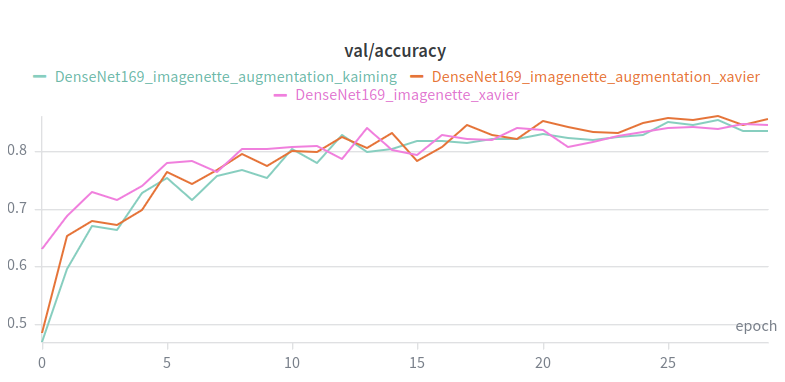
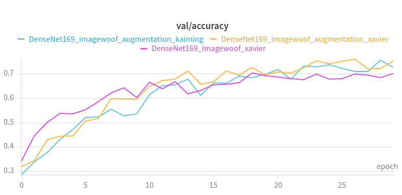 
<em>Left: Validation accuracy on imagenette — Right: Validation accuracy on imagewoof</em>

Below is a table with the maximum validation accuracy for each run and the rank among all 30 training runs on the same dataset (3 runs per model and 10 models)

<table>
<tr><td>

**Imagenette**
| Run type | Max val acc | Rank (out of 30) |
|---|---|---|
| no_aug_xavier | 0.8468 | 7 |
| aug_xavier | 0.8614 | 1 |
| aug_kaiming | 0.8532 | 5 |

</td><td>

**Imagewoof**
| Run type | Max val acc | Rank (out of 30) |
|---|---|---|
| no_aug_xavier | 0.7017 | 13 |
| aug_xavier | 0.7604 | 3 |
| aug_kaiming | 0.7549 | 4 |

</td></tr>

</table>

The best result on imagenette (rank 1) is obtained with this model.

##### DenseNet201

###### Model info

| Metric | Value | Rank (out of 10) |
|---|---|---|
| Parameters | 20,013,928 | 5 |
| FLOPs | 8,582,732,776 | 2 |

The largest of the three DenseNet variants, with the second highest FLOPs count overall, just behind VGG16.

###### Results

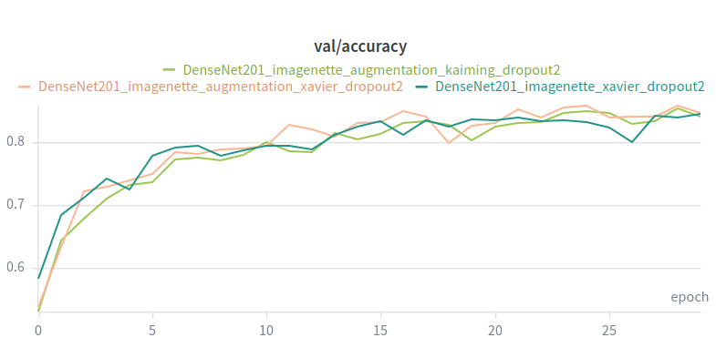
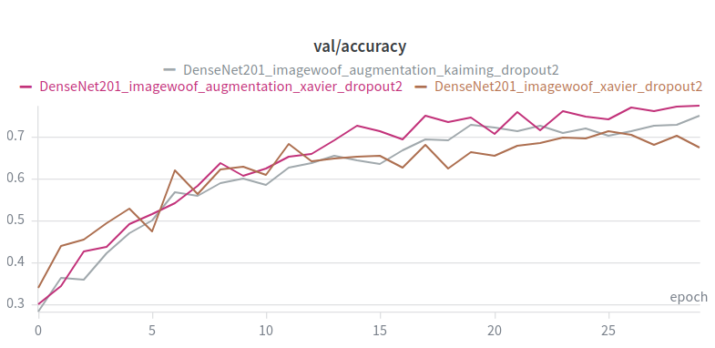 
<em>Left: Validation accuracy on imagenette — Right: Validation accuracy on imagewoof</em>

Below is a table with the maximum validation accuracy for each run and the rank among all 30 training runs on the same dataset (3 runs per model and 10 models)

<table>
<tr><td>

**Imagenette**
| Run type | Max val acc | Rank (out of 30) |
|---|---|---|
| no_aug_xavier | 0.8447 | 10 |
| aug_xavier | 0.8591 | 2 |
| aug_kaiming | 0.8544 | 4 |
</td><td>

**Imagewoof**
| Run type | Max val acc | Rank (out of 30) |
|---|---|---|
| no_aug_xavier | 0.7120 | 12 |
| aug_xavier | 0.7748 | 1 |
| aug_kaiming | 0.7492 | 5 |

</td></tr>
</table>

The best result on imagewoof (rank 1) is obtained with this model.

### Leaderboard

The leaderboard below shows only the best run out of the 3 for each model on each dataset.
For each row are reported:
- Max val acc: max validation accuracy of the best run out of the 3
- Acc rank: rank of the model based on max val acc (1 = best)
- Param rank: rank of the model based on parameter count (1 = most parameters)
- FLOP rank: rank of the model based on FLOPs count (1 = most FLOPs)

> Note: Parameter and FLOPs counts are computed for the original 1000 class version of the models (final classifier with 1000 outputs), while training was done with 10 classes.

#### Imagenette

| Model | Max val acc | Acc rank | Param rank | FLOP rank |
|---|---|---|---|---|
| DenseNet169 | 0.8614 | 1 | 6 | 4 |
| DenseNet201 | 0.8591 | 2 | 5 | 2 |
| DenseNet121 | 0.8590 | 3 | 8 | 5 |
| VGG16 | 0.8456 | 4 | 1 | 1 |
| ResNet18 | 0.8436 | 5 | 7 | 6 |
| ResNext50 | 0.8311 | 6 | 4 | 3 |
| AlexNet | 0.8160 | 7 | 2 | 8 |
| GoogLeNet | 0.8144 | 8 | 10 | 7 |
| VGGSmaller | 0.7930 | 9 | 3 | 10 |
| NiN | 0.7194 | 10 | 9 | 9 |

#### Imagewoof

| Model | Max val acc | Acc rank | Param rank | FLOP rank |
|---|---|---|---|---|
| DenseNet201 | 0.7748 | 1 | 5 | 2 |
| DenseNet121 | 0.7698 | 2 | 8 | 5 |
| DenseNet169 | 0.7604 | 3 | 6 | 4 |
| ResNet18 | 0.7475 | 4 | 7 | 6 |
| VGG16 | 0.7375 | 5 | 1 | 1 |
| ResNext50 | 0.6750 | 6 | 4 | 3 |
| AlexNet | 0.6730 | 7 | 2 | 8 |
| VGGSmaller | 0.6458 | 8 | 3 | 10 |
| GoogLeNet | 0.6377 | 9 | 10 | 7 |
| NiN | 0.4375 | 10 | 9 | 9 |

